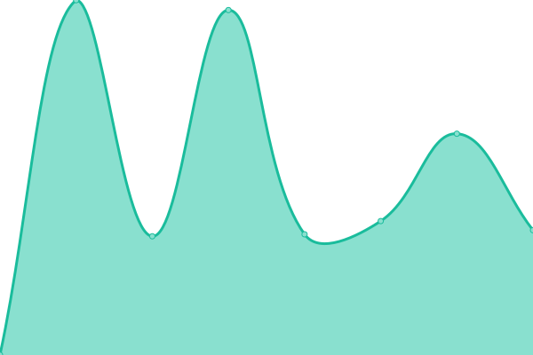

# [📈 Live Status](https://valassis-fcalle.github.io/savi-uptime): <!--live status--> **🟩 All systems operational**

This repository contains the open-source uptime monitor and status page for [Francisco Calle](https://valassis-fcalle.github.io/savi-uptime), powered by [Upptime](https://github.com/upptime/upptime).

With [Upptime](https://upptime.js.org), you can get your own unlimited and free uptime monitor and status page, powered entirely by a GitHub repository. We use [Issues](https://github.com/valassis-fcalle/savi-uptime/issues) as incident reports, [Actions](https://github.com/valassis-fcalle/savi-uptime/actions) as uptime monitors, and [Pages](https://valassis-fcalle.github.io/savi-uptime) for the status page.

<!--start: status pages-->
<!-- This summary is generated by Upptime (https://github.com/upptime/upptime) -->
<!-- Do not edit this manually, your changes will be overwritten -->
<!-- prettier-ignore -->
| URL | Status | History | Response Time | Uptime |
| --- | ------ | ------- | ------------- | ------ |
|  [OfferManager](https://coupons.valassis.eu/lib/offermanager/latest/init.html?mapped=/capi/) | 🟩 Up | [offer-manager.yml](https://github.com/valassis-fcalle/savi-uptime/commits/HEAD/history/offer-manager.yml) | 

 589ms
     
 | 

<a href="https://valassis-fcalle.github.io/savi-uptime/history/offer-manager">100.00%</a>
    

|  [🇩🇪 Savi Deutschland](https://savigermany.de/) | 🟩 Up | [savi-deutschland.yml](https://github.com/valassis-fcalle/savi-uptime/commits/HEAD/history/savi-deutschland.yml) | 

 937ms
     
 | 

<a href="https://valassis-fcalle.github.io/savi-uptime/history/savi-deutschland">89.14%</a>
    

|  [🇪🇸 Savi Spain](https://www.valesycupones.es/) | 🟩 Up | [savi-spain.yml](https://github.com/valassis-fcalle/savi-uptime/commits/HEAD/history/savi-spain.yml) | 

 732ms
     
 | 

<a href="https://valassis-fcalle.github.io/savi-uptime/history/savi-spain">100.00%</a>
    

|  [🇮🇹 Savi Italy](https://saviitalia.it/) | 🟩 Up | [savi-italy.yml](https://github.com/valassis-fcalle/savi-uptime/commits/HEAD/history/savi-italy.yml) | 

 875ms
     
 | 

<a href="https://valassis-fcalle.github.io/savi-uptime/history/savi-italy">89.15%</a>
    

|  [🇬🇧 Savi UK](https://saviuk.co.uk/) | 🟩 Up | [savi-uk.yml](https://github.com/valassis-fcalle/savi-uptime/commits/HEAD/history/savi-uk.yml) | 

 712ms
     
 | 

<a href="https://valassis-fcalle.github.io/savi-uptime/history/savi-uk">100.00%</a>
    

<!--end: status pages-->

[**Visit our status website →**](https://valassis-fcalle.github.io/savi-uptime)

## 📄 License

- Powered by: [Upptime](https://github.com/upptime/upptime)
- Code: [MIT](./LICENSE) © [Francisco Calle](https://valassis-fcalle.github.io/savi-uptime)
- Data in the `./history` directory: [Open Database License](https://opendatacommons.org/licenses/odbl/1-0/)
